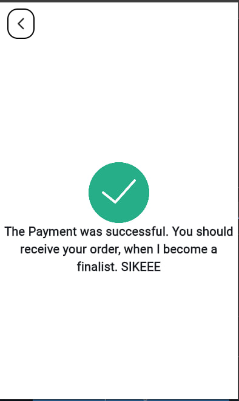

# Shoe E-commerce App - HNG Internship Stage 1


## Appetize Demo
[Demo Link](https://appetize.io/app/zxl5j6sxuspyecuorq2skobxhu?device=pixel7&osVersion=13.0)

## Screenshots





## Instructions to Set Up

**Installation:**

1. **Ensure you have Flutter SDK installed on your machine. If not, refer to the official Flutter documentation for installation instructions: [Flutter Documentation](https://flutter.dev/docs/get-started/install)**


2. **Clone the repository:**

   ```bash
   git clone https://github.com/adebola-duf/hng-stage-1.git
   ```

3. **Navigate to project directory**
    ```bash
    cd hng-stage-1/myapp
    ```
4. **Install dependencies using Flutter:**
    ```bash
    flutter pub get
    ```

5. **Run the app on an emulator or a physical device:**
    ```bash
    cd hng-stage-1/myapp

## Attribution

The success.jpg used 
<a href="https://www.flaticon.com/free-icons/done" title="done icons">Done icons created by Smashicons - Flaticon</a>
